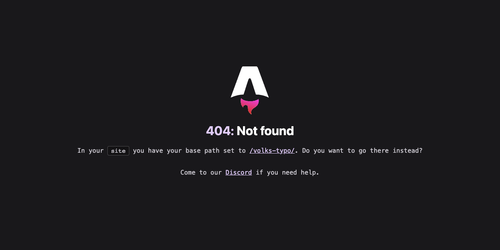
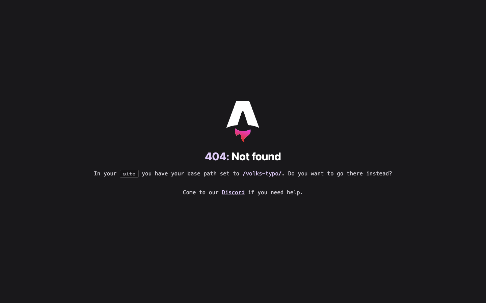
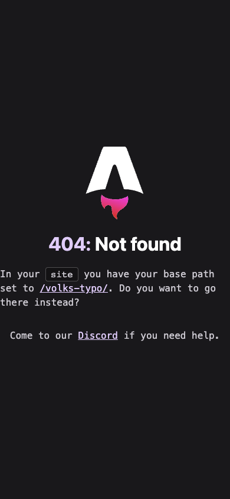
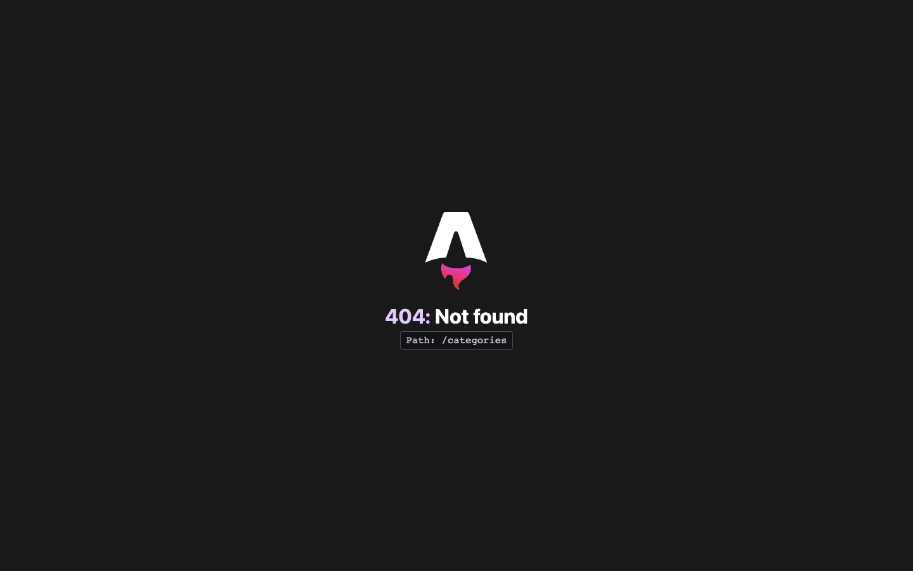

# Volks-Typo

[](https://astro.build)
[](https://opensource.org/licenses/MIT)

A striking Astro blog theme that explores the aesthetic tension between Bauhaus modernism and WW2-era monumental design. Volks-Typo creates a "dissonant harmony" that is visually compelling, highly functional, and conceptually rich.


*Striking typography and the distinctive blood-red monumental rule that defines Volks-Typo's unique aesthetic*

## 🎨 Theme by

**[@jdrhyne](https://github.com/jdrhyne)** • Personal blog: [jdrhyne.me](https://jdrhyne.me) (Still under construction 🚧)

## 🌟 Features

✓ **Unique Design Philosophy** - Bauhaus functionalism meets monumental aesthetics  
✓ **Ultra-Minimalist** - Clean, focused design with purposeful use of space  
✓ **Responsive Layout** - Mobile-first with elegant desktop sidebar  
✓ **Lightning Fast** - Zero JavaScript, minimal CSS (~20KB gzipped)  
✓ **Full Blog Support** - Categories, tags, archives, and recent posts  
✓ **SEO Optimized** - Built-in meta tags and structured data  
✓ **Accessibility First** - Semantic HTML and ARIA attributes  
✓ **Self-Hosted Fonts** - No external dependencies for privacy  
✓ **Type-Safe** - Full TypeScript support  
✓ **Easy Configuration** - Single config file for all settings  


*Desktop layout showcasing the elegant two-column design with sidebar navigation*  

## 🚀 Demo

Check out the live demo to see Volks-Typo in action (demo link coming soon).

## 💻 Tech Stack

- **Framework:** [Astro](https://astro.build)
- **Type Checking:** TypeScript
- **Styling:** Scoped CSS with CSS Variables
- **Fonts:** Self-hosted via @fontsource
- **Icons:** Minimal SVG icons

## 🛠️ Quick Start

### Prerequisites

- Node.js 18.14.1 or higher
- Git

### Create a new project

```bash
# npm
npm create astro@latest -- --template jdrhyne/volks-typo

# pnpm
pnpm create astro@latest --template jdrhyne/volks-typo

# yarn
yarn create astro --template jdrhyne/volks-typo
```

### Manual Installation

1. Clone this repository:
```bash
git clone https://github.com/jdrhyne/volks-typo.git my-blog
cd my-blog
```

2. Install dependencies:
```bash
npm install
# or
pnpm install
# or
yarn install
```

3. Start the development server:
```bash
npm run dev
# or
pnpm run dev
# or
yarn dev
```

4. Open your browser at `http://localhost:4321`

## 📁 Project Structure

```
volks-typo/
├── public/
│   ├── favicon.svg          # Site favicon
│   └── site-title.svg       # Fraktur-style site title
├── src/
│   ├── components/
│   │   ├── Footer.astro     # Site footer with social links
│   │   ├── Header.astro     # Site header with navigation
│   │   ├── Layout.astro     # Main layout wrapper
│   │   └── Sidebar.astro    # Desktop sidebar component
│   ├── pages/
│   │   ├── index.astro      # Homepage
│   │   ├── about.astro      # About page
│   │   ├── blog.astro       # Blog listing page
│   │   ├── blog/
│   │   │   ├── [...slug].astro  # Dynamic blog post pages
│   │   │   └── *.md            # Your blog posts
│   │   ├── categories.astro # Categories listing
│   │   └── contact.astro    # Contact page
│   ├── styles/
│   │   └── global.css       # Global styles and CSS variables
│   └── config.ts            # Site configuration
├── astro.config.mjs         # Astro configuration
├── package.json
└── tsconfig.json           # TypeScript configuration
```

## ⚙️ Configuration

All site configuration is centralized in `src/config.ts`:

```typescript
export const config = {
  title: "Volks-Typo",
  description: "A blog exploring the intersection of design, typography, and history",
  author: {
    name: "Your Name",
    bio: "Writer, designer, and explorer of aesthetic tensions.",
    avatar: "/avatar.jpg"
  },
  social: {
    github: "https://github.com/yourusername",
    twitter: "https://twitter.com/yourusername",
    instagram: "https://instagram.com/yourusername",
    linkedin: "https://linkedin.com/in/yourusername",
    email: "your.email@example.com"
  },
  siteUrl: "https://yourdomain.com"
};
```

## 🎨 Design System

### Typography

Volks-Typo uses a carefully curated typography system that creates visual hierarchy through contrast:

- **Headings:** Cormorant Garamond (H1) and Playfair Display (H2, H3) - "Stripped Classicism" with all caps, wide letter-spacing, and bold weight
- **Body Text:** Inter - Clean, highly readable sans-serif optimized for screens
- **Code:** JetBrains Mono - Developer-friendly monospace font
- **Special:** Fraktur-style SVG for the main site title

### Color Palette

The theme employs a sophisticated dual palette system:

**Primary (Bauhaus)**
- Parchment White (`#f0e9d6`) - Main backgrounds
- Charcoal Black (`#2c2c2c`) - Body text
- Muted Red (`#c13127`) - Links and active states
- Deep Blue (`#005a8d`) - Secondary accents
- Ochre Yellow (`#e8a100`) - Tags and categories

**Secondary (Monumental)**
- Blood Red (`#8b0000`) - Oversized headings
- Stone Beige (`#d4c8a0`) - Header/footer backgrounds
- Steel Gray (`#3d3d3d`) - Borders and dividers

### Layout System

- **Mobile/Tablet:** Single column, full-width content
- **Desktop (1024px+):** Two-column layout with left sidebar
- **Grid:** 8-point grid system for consistent spacing
- **Max Width:** 1200px container for optimal reading


*Responsive mobile layout maintaining the theme's distinctive aesthetic on smaller screens*


*Categories page featuring the ochre yellow accent color and clean grid layout*

## 📝 Writing Content

### Blog Posts

Create blog posts as Markdown files in `src/pages/blog/`:

```markdown
---
title: "The Intersection of Function and Form"
date: "2024-01-15"
author: "Your Name"
excerpt: "Exploring how Bauhaus principles shaped modern design thinking"
categories: ["Design", "History"]
tags: ["bauhaus", "modernism", "typography"]
image: "/images/bauhaus-poster.jpg"
draft: false
---

Your content here...
```

### Frontmatter Reference

| Field | Type | Required | Description |
|-------|------|----------|-------------|
| `title` | string | Yes | Post title |
| `date` | string | Yes | Publication date (YYYY-MM-DD) |
| `author` | string | No | Author name (defaults to config) |
| `excerpt` | string | No | Brief description for listings |
| `categories` | array | No | Post categories |
| `tags` | array | No | Post tags |
| `image` | string | No | Featured image path |
| `draft` | boolean | No | Hide from listings if true |

## 🛠️ Commands

All commands are run from the root of the project:

| Command | Action |
|---------|--------|
| `npm install` | Install dependencies |
| `npm run dev` | Start local dev server at `localhost:4321` |
| `npm run build` | Build production site to `./dist/` |
| `npm run preview` | Preview your build locally |
| `npm run astro ...` | Run CLI commands like `astro add` |
| `npm run check` | Check TypeScript types |
| `npm run lint` | Run ESLint |

## 🚀 Deployment

Volks-Typo generates a static site that can be deployed anywhere:

### Netlify
```bash
npm run build
# Deploy the 'dist' folder
```

### Vercel
```bash
npm run build
# Use Vercel CLI or GitHub integration
```

### GitHub Pages
1. Update `astro.config.mjs` with your repository name
2. Run `npm run build`
3. Deploy the `dist` folder to GitHub Pages

## 📊 Performance

Volks-Typo is optimized for speed and efficiency:

- **Zero JavaScript** - Pure HTML and CSS
- **Minimal CSS** - ~20KB gzipped total
- **Self-hosted fonts** - No external requests
- **Optimized images** - Using Astro's Image component
- **Static generation** - Fast page loads

## 🎯 Customization Guide

### Colors

Edit CSS variables in `src/styles/global.css`:

```css
:root {
  /* Primary Palette */
  --color-parchment: #f0e9d6;
  --color-charcoal: #2c2c2c;
  --color-muted-red: #c13127;
  --color-deep-blue: #005a8d;
  --color-ochre: #e8a100;
  
  /* Secondary Palette */
  --color-blood-red: #8b0000;
  --color-stone-beige: #d4c8a0;
  --color-steel-gray: #3d3d3d;
}
```

### Typography

Modify font families in `src/styles/global.css`:

```css
:root {
  --font-heading-primary: 'Cormorant Garamond', serif;
  --font-heading-secondary: 'Playfair Display', serif;
  --font-body: 'Inter', sans-serif;
  --font-mono: 'JetBrains Mono', monospace;
}
```

### Layout

The theme uses CSS Grid for layouts. Key files:
- `src/components/Layout.astro` - Main grid container
- `src/components/Sidebar.astro` - Desktop sidebar
- `src/styles/global.css` - Responsive breakpoints

## 🤝 Contributing

Contributions are welcome! Please feel free to submit a Pull Request. For major changes, please open an issue first to discuss what you would like to change.

1. Fork the repository
2. Create your feature branch (`git checkout -b feature/amazing-feature`)
3. Commit your changes (`git commit -m 'Add some amazing feature'`)
4. Push to the branch (`git push origin feature/amazing-feature`)
5. Open a Pull Request

## 📄 License

This project is licensed under the MIT License - see the [LICENSE](LICENSE) file for details.

## 🙏 Acknowledgments

- Design philosophy inspired by the Bauhaus movement and WW2-era monumental aesthetics
- Built with [Astro](https://astro.build)
- Typography powered by [Fontsource](https://fontsource.org/)

## 💬 Support

- **Issues:** [GitHub Issues](https://github.com/jdrhyne/volks-typo/issues)
- **Discussions:** [GitHub Discussions](https://github.com/jdrhyne/volks-typo/discussions)
- **Author:** [@jdrhyne](https://github.com/jdrhyne) • Personal blog: [jdrhyne.me](https://jdrhyne.me) (under construction 🚧) 
---

**[Volks-Typo](https://github.com/jdrhyne/volks-typo)** by [@jdrhyne](https://github.com/jdrhyne) • MIT License
